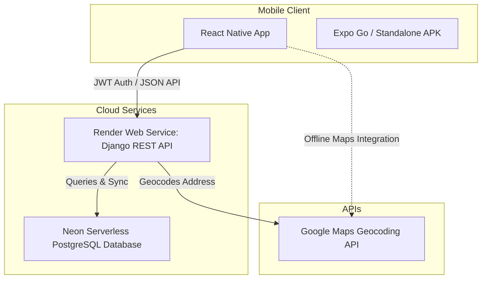

# ♻️ Trashformers — Smart Waste Trade Platform

[](https://reactnative.dev/)
[](https://expo.dev/)
[](https://www.djangoproject.com/)
[](https://www.postgresql.org/)
[](https://www.typescriptlang.org/)
[](https://render.com/)
[](https://neon.tech/)

> **Smart Waste Trade Platform for Sustainable Urban Waste Management**
> Connecting waste generators directly with local recyclers, scrap dealers, and repurposing industries to keep recyclables out of landfills and reduce carbon footprints.

---

## 🌟 The Vision

Urban waste (plastics, metal, paper, e-waste, biodegradable matter) represents massive economic and ecological value. **Trashformers** bridges the gap between those who produce waste and those who can recycle it. By replacing chaotic scrap trade with a localized, transparent, and structured digital marketplace, we accelerate the circular economy.

---

## 🚀 Key Features

* **🗺️ Location-Aware Marketplace:** Automatically calculates distance (using the **Haversine formula** and Google Maps API) between buyers and sellers, showing closest listings first to reduce transport emissions.
* **👤 Dual-Role Accounts:** Seamlessly switch between **Buyer** and **Seller** modes within a single profile.
* **📦 Complete Order Lifecycle:** Full pipeline from listing items, placing quantities, scheduling pickups, to accepting and completing transactions.
* **💬 In-App Messaging:** One-on-one negotiation and pickup coordination (lightweight REST-based chat with read receipts and unread badges).
* **⭐ Community Trust:** Dynamic rating system where buyers and sellers review each other post-transaction.
* **🛡️ Moderation & Security:** Integrated reporting/complaints system for fake listings, incorrect categorization, or fraud, with Django Admin moderation.

---

## 📐 System Architecture



---

## 📁 Repository Structure

```
Trashformers/
├── backend/               # Django REST Framework Backend
│   ├── config/            # Settings, URLs, and WSGI configuration
│   ├── users/             # JWT auth & profiles
│   ├── listings/          # Waste items, categories, and geocoding
│   ├── orders/            # Pickups and order transactions
│   ├── chat/              # Chat conversations & message history
│   ├── reviews/           # post-order reviews and ratings
│   ├── complaints/        # Reporting & moderation
│   ├── core/              # Shared helper functions (distance calculations)
│   ├── build.sh           # Cloud build script for Render
│   └── requirements.txt   # Python dependency list
├── frontend/              # React Native Mobile App
│   ├── src/
│   │   ├── api/           # Axios interceptors & API wrappers
│   │   ├── components/    # Reusable UI widgets (e.g. Map components)
│   │   ├── context/       # Authentication State Context
│   │   └── screens/       # Views (Auth, Home, Listings, Chat, Orders)
│   ├── eas.json           # Expo Application Services configuration
│   └── package.json       # React Native dependencies
├── render.yaml            # Render infrastructure-as-code Blueprint
└── project.md             # Full technical product specifications
```

---

## 🌐 24/7 Cloud Deployment

The backend is fully deployed and accessible 24/7:
* **Production API Base URL:** `https://trashformers-backend.onrender.com/api`
* **Production Database:** Managed serverless PostgreSQL on **Neon.tech**.
* **API Administration Portal:** `https://trashformers-backend.onrender.com/admin/`

---

## 🛠️ Local Development & Quick Start

### 1. Backend Setup

Prerequisites: Python 3.11+, PostgreSQL.

```bash
# Navigate to backend
cd backend

# Create & activate virtualenv
python -m venv venv
source venv/bin/activate  # macOS/Linux
venv\Scripts\activate     # Windows

# Install dependencies
pip install -r requirements.txt

# Create your .env file
# (Setup database details and GOOGLE_MAPS_API_KEY)
# Run migrations & seed categories
python manage.py migrate
python manage.py shell -c "from listings.models import Category; [Category.objects.get_or_create(name=c[0], defaults={'description': f'{c[1]} waste materials', 'icon': c[0]}) for c in Category.CATEGORY_CHOICES]"

# Launch dev server
python manage.py runserver
```

### 2. Frontend Setup

Prerequisites: Node.js, Expo Go app installed on your phone.

```bash
# Navigate to frontend
cd frontend

# Install packages
npm install

# Point src/config.ts to your backend IP (e.g. localhost or Render URL)
# Start the Metro bundler
npx expo start
```
Scan the QR code with your phone (iOS Camera or Android Expo Go app) to run the application!

---

## 📱 Compiling Standalone Android App (APK)

To compile a standalone APK that can be installed on any device:
```bash
cd frontend
npx eas build --platform android --profile preview
```
This triggers a cloud compilation on **Expo Application Services (EAS)** and generates an installable `.apk` file for your presentations or testing!

---

## 🎨 UI Design System

* **Theme:** Sleek modern Dark Mode
* **Background Color:** Slate Dark (`#0f172a`)
* **Accent Color:** Vibrant Green (`#4ade80`)
* **Typography:** Premium layout with smooth gradients and micro-animations.

---

## 📄 License
This project is licensed under the MIT License - see the `LICENSE` file for details.
Designed and built for sustainability, circular economy, and smarter waste trading. 🌿
