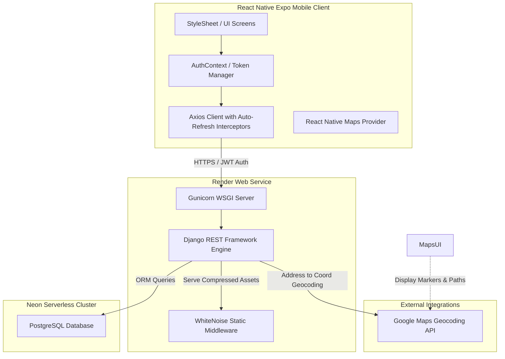
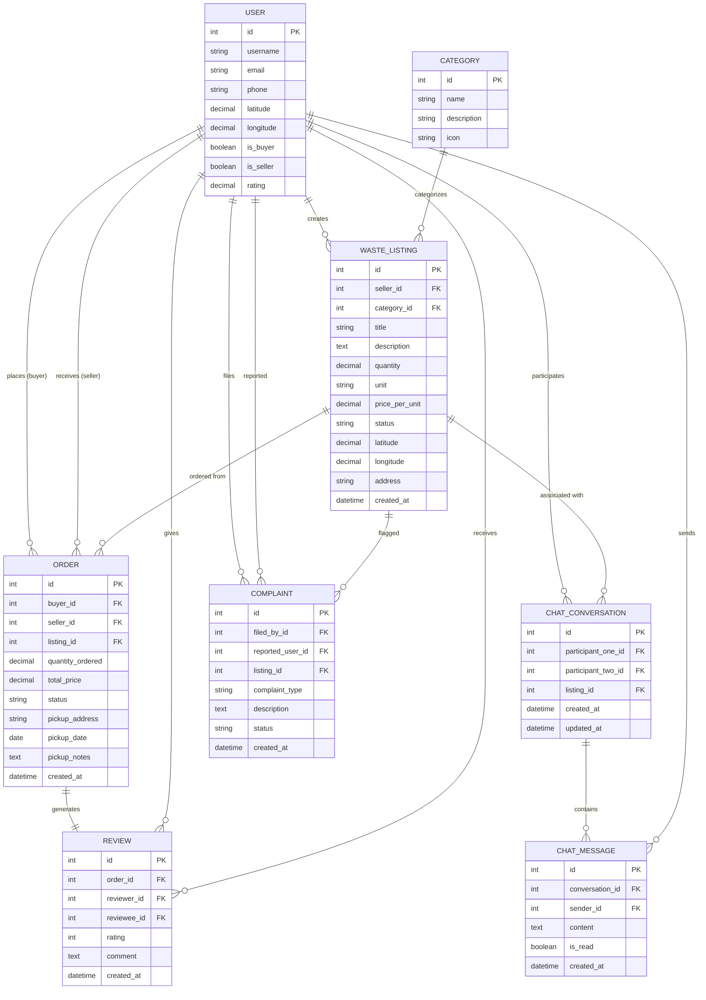

# ♻️ Trashformers — Smart Waste Trade Platform

[](https://reactnative.dev/)
[](https://expo.dev/)
[](https://www.djangoproject.com/)
[](https://www.postgresql.org/)
[](https://www.typescriptlang.org/)
[](https://render.com/)
[](https://neon.tech/)

> **Smart Waste Trade Platform for Sustainable Urban Waste Management**
> A production-grade, full-stack, mobile-first marketplace connecting waste generators directly with local recyclers, scrap dealers, and repurposing industries to keep recyclables out of landfills.

---

## 📐 System Architecture & Flow



---

## 🛠️ Detailed Technical Stack Specifications

### 1. Mobile Client (React Native + TypeScript + Expo)
* **Architecture:** Modular component-based layout with clean separation of services, hooks, and context.
* **Navigation:** Nested navigator hierarchy using `@react-navigation/native`. Incorporates `BottomTabNavigator` for primary sections and `NativeStackNavigator` for detail/auth paths.
* **Authentication State Management:** Implemented custom React `AuthContext` to manage user sessions globally. Includes persistent storage integration with `@react-native-async-storage/async-storage`.
* **API Networking & Token Handlers:** Built an `Axios` instance equipped with:
  * **Request Interceptor:** Dynamically attaches active JWT Bearer tokens to the `Authorization` header.
  * **Response Interceptor:** Automatically intercepts `401 Unauthorized` responses, triggers a background Token Refresh API call using the stored refresh token, updates the access token, and retries the original request seamlessly.
* **Maps & Geolocation:** Utilizes `react-native-maps` for visual marker selection, coordinates projection, and offline navigation mapping using native Google Play services.

### 2. API Backend (Django + Django REST Framework)
* **REST Engine:** Built upon Django's Model-View-Controller framework, exposing pure JSON endpoints via Django REST Framework (DRF) generic API views.
* **Custom Authentication:** Token-based security using `django-rest-framework-simplejwt`. Configured with token rotation (a new refresh token is issued on each refresh call) and strict token blacklisting to secure logouts.
* **Geographical Computations:** Integrates Google Geocoding API dynamically. When a seller lists a waste item with an address but no coordinates, the backend geocodes the address into latitude/longitude on save.
* **Static Assets Delivery:** Integrates `whitenoise` middleware. During cloud builds, it runs `collectstatic` to package, compress, and cache static files directly through the WSGI layer, eliminating the need for a separate Nginx config.

### 3. Serverless Database (PostgreSQL + Neon.tech)
* **Relational Schema Design:** Utilizes a highly normalized database layout enforcing strong relational constraints, composite indices on listing searches, and transactions on orders.
* **Custom Auth Model:** Overrides Django's base user model with a custom `User` table (inheriting `AbstractUser`) to support dual-role configurations (`is_buyer`, `is_seller`), telephone validation, ratings, and location coordinates.
* **Precision Datatypes:** Coordinates are stored as `DecimalField(max_digits=9, decimal_places=6)` to maintain sub-meter precision in geographic calculations.

---

## 🔬 Core Algorithms & Database Schemas

### 1. The Haversine Formula (Location-Aware Discovery)
To sort listings by physical proximity and calculate transport distances without heavy GIS database engines like PostGIS, Trashformers implements the **Haversine formula** directly in SQL/Python query-sets and client-side calculators. 

$$d = 2R \arcsin\left(\sqrt{\sin^2\left(\frac{\Delta \phi}{2}\right) + \cos(\phi_1)\cos(\phi_2)\sin^2\left(\frac{\Delta \lambda}{2}\right)}\right)$$

Where:
* $\phi_1, \phi_2$ = latitudes of user and listing (in radians)
* $\Delta \phi, \Delta \lambda$ = differences in latitude and longitude
* $R$ = Earth's mean radius ($6371\text{ km}$)

*Implementation snippet:*
```python
def haversine(lat1, lon1, lat2, lon2):
    R = 6371  # Earth's radius in kilometers
    phi1, phi2 = math.radians(lat1), math.radians(lat2)
    dphi = math.radians(lat2 - lat1)
    dlambda = math.radians(lon2 - lon1)
    a = math.sin(dphi / 2)**2 + math.cos(phi1) * math.cos(phi2) * math.sin(dlambda / 2)**2
    return R * 2 * math.atan2(math.sqrt(a), math.sqrt(1 - a))
```

### 2. Database Schema (Entity-Relationship Diagram)



---

## 📡 API Contract Specification

All API endpoints return standardized JSON payloads. Standard pagination returns list endpoints wrapped inside a count and results block.

| Method | Endpoint | Authentication | Request Payload (JSON) | Success Code | Response Sample |
| :--- | :--- | :--- | :--- | :--- | :--- |
| **POST** | `/api/auth/register/` | Public | `{username, email, password, password2, phone}` | `201` | `{message, user: {...}, tokens: {access, refresh}}` |
| **POST** | `/api/auth/login/` | Public | `{username, password}` | `200` | `{message, user: {...}, tokens: {access, refresh}}` |
| **PUT** | `/api/auth/profile/` | JWT Bearer | `{latitude, longitude, is_buyer, bio}` | `200` | `{message, user: {...}}` |
| **GET** | `/api/listings/` | JWT Bearer | Query params: `?category=plastic&sort=distance&latitude=12.9&longitude=77.5` | `200` | `{count, page, results: [...]}` |
| **POST** | `/api/listings/` | JWT Bearer (Seller) | `{title, description, category, quantity, unit, price_per_unit, address}` | `201` | `{id, title, distance_km, total_price, ...}` |
| **POST** | `/api/orders/create/` | JWT Bearer (Buyer) | `{listing_id, quantity_ordered, pickup_date}` | `201` | `{id, total_price, status: "pending", ...}` |
| **PATCH**| `/api/orders/{id}/` | JWT Bearer | `{status: "accepted" \| "completed"}` | `200` | `{message, order: {...}}` |
| **POST** | `/api/chat/send/` | JWT Bearer | `{recipient_id, content}` | `201` | `{id, conversation, sender: {...}, content, is_read}` |
| **GET** | `/api/chat/conversations/`| JWT Bearer | None | `200` | `{count, results: [{id, other_user: {...}, unread_count}]}` |
| **POST** | `/api/reviews/` | JWT Bearer | `{order: id, rating: 5, comment}` | `201` | `{id, rating, reviewee_username}` |
| **POST** | `/api/complaints/` | JWT Bearer | `{reported_user, listing, complaint_type, description}` | `201` | `{id, complaint_type, status: "open"}` |

---

## 🔒 Production Hardening & Cloud Configurations

### 1. Render Web Service Custom Setup
In order to run the Django project on **Render** (Free Web Service tier) securely and without local system dependencies, the build uses the following setup:
* **Gunicorn Server:** Bypasses Django's standard single-threaded development server by running a multi-threaded Gunicorn worker pool:
  `gunicorn config.wsgi:application`
* **Static Asset serving via WhiteNoise:** Embedded in `settings.py` directly under SecurityMiddleware:
  ```python
  MIDDLEWARE = [
      ...
      'django.middleware.security.SecurityMiddleware',
      'whitenoise.middleware.WhiteNoiseMiddleware',
      ...
  ]
  ```
  And configured to cache and gzip compiled static assets automatically:
  ```python
  STORAGES = {
      "default": {
          "BACKEND": "django.core.files.storage.FileSystemStorage",
      },
      "staticfiles": {
          "BACKEND": "whitenoise.storage.CompressedManifestStaticFilesStorage",
      },
  }
  ```

### 2. Environment Variables Configuration
The system dynamically configures itself on boot using environment variables parsed by `python-decouple` and `dj-database-url`:
* `DEBUG`: Set to `False` in production to prevent traceback leaks.
* `DATABASE_URL`: Automatically parses connection details from **Neon Serverless PostgreSQL** database clusters.
* `SECRET_KEY`: Autogenerated cryptographically secure key injected by the PaaS manager.
* `GOOGLE_MAPS_API_KEY`: Injected into the runtime for backend address geocoding.

---

## 🛠️ Installation & Local Deploy Guide

Refer to [README.md](file:///C:/Users/ABHIRAM/.gemini/antigravity/scratch/Trashformers/README.md) or execute:

### 1. Backend Dev Server:
```bash
cd backend
python -m venv venv
venv\Scripts\activate   # Windows
pip install -r requirements.txt
python manage.py migrate
python manage.py runserver
```

### 2. Frontend Dev Server:
```bash
cd frontend
npm install
npx expo start --tunnel
```

---

## 📄 License
This project is licensed under the MIT License - see the `LICENSE` file for details.
Designed and built for sustainability, circular economy, and smarter waste trading. 🌿
